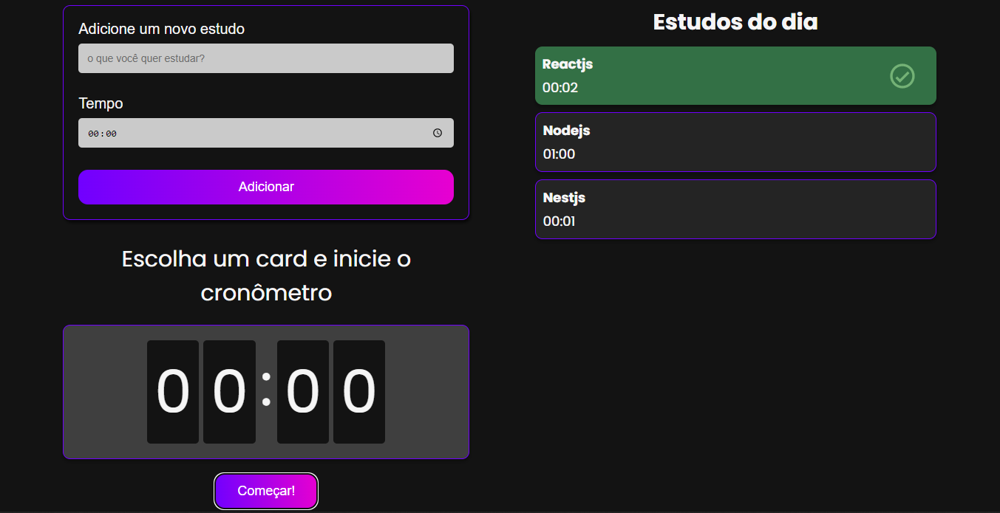
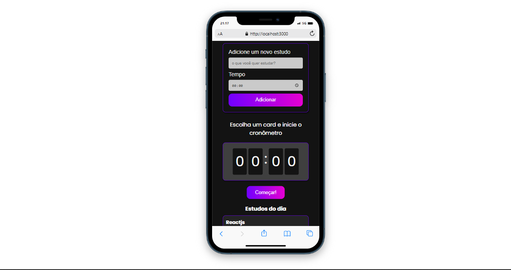

<h1 align="center">Study Timer</h1>
 
 

<h1>Desktop 🖥️ </h1>

  

<h1>Mobile 📱</h1>

  

<h1> Sobre 🔖</h1>

 Cronômetro de tarefas a estudar feito com React e Typescript.

 

<h1> Tecnologias Utilizadas 🚀</h1>

<h3>
 • <a href="https://pt-br.reactjs.org">React.js</a>  
 • <a href="https://github.com/css-modules/css-modules">Css Modules</a>  
 • <a href="https://www.typescriptlang.orgt">Typescript</a>  
 
</h3>

 
